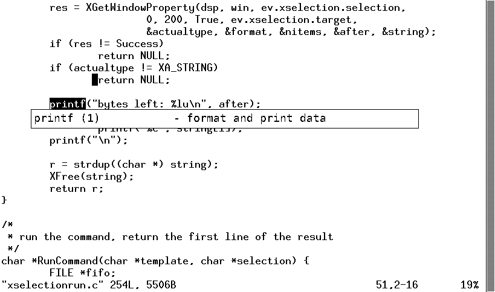
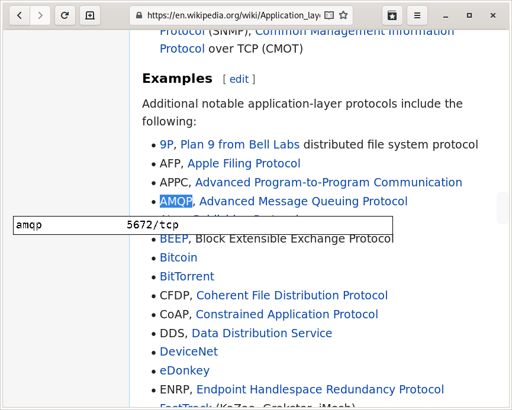

xselectionrun
=============

Run a program on the X11 selection on ``F1`` and display the result.
Pressing ``F1`` removes the result from the screen.

examples
--------

Can be used to display a sort of inline help that is independent on the
application, or to help filling web forms.

- ``xselectionrun 'man -f %s | head -1'``;
  selecting a word in whichever program and pressing F1 shows its short
  description from the man page of the word, if any;
  for example, if the word ``printf`` is selected in an xterm,
  the following is displayed:
  ``printf (1)           - format and print data``

- ``xselectionrun 'grep -i "^%s " /etc/services'``;
  if the selection is a tcp protocol name, display its port

- ``xselectionrun 'grep "^%s" data.txt'``;
  selecting a word and pressing F1 shows the line of the
  ``data.txt`` file that begins with the word

screenshots
-----------

